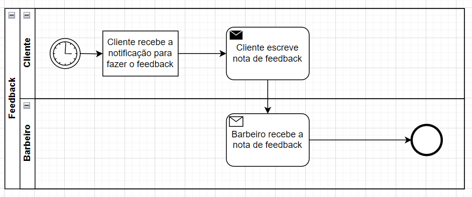

### 3.3.2 Processo 2 – Feedback

O processo de feedback captura avaliações dos clientes após a prestação de serviços, utilizando um sistema que confirma e registra as respostas para análise e melhoria contínua da qualidade.

#### Detalhamento das atividades

_Atividade 1 - O sistema de notificação envia automaticamente uma mensagem ao cliente após a prestação do serviço, solicitando que ele forneça um feedback._
_Atividade 2 - O cliente acessa a plataforma fornecida e preenche um formulário com suas observações e avaliação sobre o serviço._
_Atividade 3 - O sistema envia a nota de feedback do cliente para o barbeiro. O barbeiro recebe uma notificação contendo todas as informações preenchidas pelo cliente no formulário de feedback._

**Cliente recebe a notificação para fazer o feedback**

| **Campo**       | **Tipo**         | **Restrições** | **Valor default** |
| ---             | ---              | ---            | ---               |
|identifcador de cliente | Caixa de Texto   | obrigatório, deve ter um email válido | - |
| mensagem de notificação| Caixa de Texto   | obrigatorio |     -     |
| data de envio | Caixa de Texto   | obrigatório, formato de data válido |    data atual    |
| método de envio | Seleção única  | obrigatório |   E-mail    |
|link para feedback| Caixa de Texto   | obrigatório, deve ser um URL válido |     -     |

**Captura de feedback**

| **Campo**       | **Tipo**         | **Restrições** | **Valor default** |
| ---             | ---              | ---            | ---               |
|identifcador de cliente | Caixa de Texto   | obrigatório, deve ter um email valido | - |
| nome do barbeiro| Caixa de Texto   | obrigatorio |     -     |
| avaliação | seleção única   | obrigatório |     -     |
| comentário | Área de Texto   | obrigatório, mínimo de 10 caracteres |     -     |
| classificação| Seleção única   | obrigatório, opcao de 1 a 5 estrelas  |     -     |

| **Comandos**         |  **Destino**                   | **Tipo** |
| ---                  | ---                            | ---               |
|enviar               | Fim do Processo           | default           |
| cancelar            | fim do processo  |        cancel           |

**Barbeiro recebe a nota de feedback**

| **Campo**       | **Tipo**         | **Restrições** | **Valor default** |
| ---             | ---              | ---            | ---               |
|identifcador de cliente | Caixa de Texto   | obrigatório | - |
| nome do barbeiro| Caixa de Texto   | obrigatório |     -     |
| avaliação | Seleção única   | obrigatório |   -  |
| comentário | Área de Texto  | obrigatório |   -    |
| classificação	| Seleção única	| obrigatório, valores de 1 a 5 estrelas	|  -  |
| data do feedback | Caixa de Texto	| obrigatório, formato de data válido |	data de envio |
