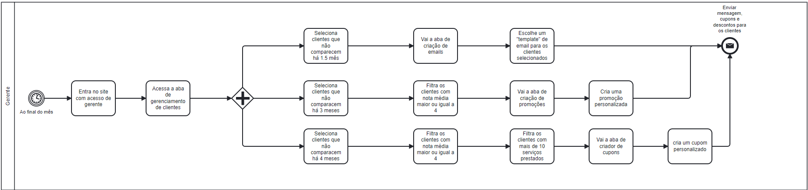

### 3.3.3 Processo 3 – Criar Cupons, descontos e emails

Processo para realizar a retenção de um cliente, enviando e-mails, descontos ou cupons baseado na quantidade de dias que não volta a barbearia.

#### Detalhamento das atividades

_O gerente acessa a aba de gerenciamento de clientes, e tem 3 opções, selecionar os clientes que não comparem a 1mes e meio, 3 meses ou 4 meses, caso escolha a primeira opção, ele é encaminhado a aba de criação de emails, escolhe um template de email para os clientes selecionados e envia uma mensagem com cupons ou descontos, caso escolha a segunda opção, os clientes com nota maior ou igual a 4 são selecionados por um filtro, em seguida é encaminhado para uma aba de criação de promoção e cria uma promoção personalizada, depois a mensagem com a promoção é enviada para o cliente, caso escolha a terceira opção, os clientes com nota maior ou igual a 4 são selecionados por um filtro, em seguida é verificado quais clientes tem mais de 10 atendimentos prestados por um filtro, depois é encaminhado para a aba de criar cupons, cria um cupom personalizado e por fim o cupom é enviado._

_Os tipos de dados a serem utilizados são:_

_* **Caixa de texto** - campo texto de única linha_

_* *Seleção única* - campo com várias opções de valores que são mutuamente exclusivas (tradicional radio button ou combobox)_

_* *Seleção múltipla* - campo com várias opções que podem ser selecionadas mutuamente (tradicional checkbox ou listbox)_

_* *Tabela* - campo formado por uma matriz de valores_

_* *Data* - campo do tipo data (dd-mm-aaaa)_

**Entrar como gerente**

| **Campo**       | **Tipo**         | **Restrições** | **Valor default** |
| ---             | ---              | ---            | ---               |
| login           | Caixa de Texto   | formato de e-mail |                |
| senha           | Caixa de Texto   | mínimo de 8 caracteres |           |

| **Comandos**         |  **Destino**                   | **Tipo** |
| ---                  | ---                            | ---               |
| entrar               | Página do Gerente              | default           |

**Acessa Gerenciamento de Clientes**

| **Comandos**         |  **Destino**                   | **Tipo** |
| ---                  | ---                            | ---               |
| Gerenciamento de Clientes               | Tabela com as informações dos clientes              | default           |

**Seleciona Clientes que não comparecem há 1.5 mês**

| **Campo**       | **Tipo**         | **Restrições** | **Valor default** |
| ---             | ---              | ---            | ---               |
| Útilma vinda           | Data   | dd-mm-aaaa |                |

| **Comandos**         |  **Destino**                   | **Tipo** |
| ---                  | ---                            | ---               |
| Confirmar Filtro               | Recarregamento das informações da tabela              | default           |

**Ir a aba de seleção de emails**

| **Comandos**         |  **Destino**                   | **Tipo** |
| ---                  | ---                            | ---               |
| Templates de Email               | Aba de seleção de Emails              | default           |

**Escolher template para clientes filtrados**

| **Campo**       | **Tipo**         | **Restrições** | **Valor default** |
| ---             | ---              | ---            | ---               |
| Email template           | Seleção única   | --- |                |

| **Comandos**         |  **Destino**                   | **Tipo** |
| ---                  | ---                            | ---               |
| Selecionar template               | Enviar email              | default           |

**Seleciona Clientes que não comparecem há 3 meses**

| **Campo**       | **Tipo**         | **Restrições** | **Valor default** |
| ---             | ---              | ---            | ---               |
| Útilma vinda           | Data   | dd-mm-aaaa |                |

| **Comandos**         |  **Destino**                   | **Tipo** |
| ---                  | ---                            | ---               |
| Confirmar Filtro               | Recarregamento das informações da tabela              | default           |

**Filtra clientes com nota média maior ou igual a 4**

| **Campo**       | **Tipo**         | **Restrições** | **Valor default** |
| ---             | ---              | ---            | ---               |
| Nota média           | Número   | mínimo de 1 máximo de 5 |                |

| **Comandos**         |  **Destino**                   | **Tipo** |
| ---                  | ---                            | ---               |
| Confirmar Filtro               | Recarregamento das informações da tabela              | default           |

**Ir a aba de criador de promoções**

| **Comandos**         |  **Destino**                   | **Tipo** |
| ---                  | ---                            | ---               |
| Criador de promoções               | Aba de criador de promoções             | default           |

**Cria promoção personalizada**

| **Campo**       | **Tipo**         | **Restrições** | **Valor default** |
| ---             | ---              | ---            | ---               |
| Desconto(%)           | Número   | Máximo de 50  |                |
| Dura até           | Data   | dd-mm-aaaa  |                |
| Critério           | Seleção múltipla   |   | 3 serviços nos próximos 2 meses              |

| **Comandos**         |  **Destino**                   | **Tipo** |
| ---                  | ---                            | ---               |
| Criar cupom               | Enviar email              | default           |

**Seleciona Clientes que não comparecem há 4 meses**

| **Campo**       | **Tipo**         | **Restrições** | **Valor default** |
| ---             | ---              | ---            | ---               |
| Útilma vinda           | Data   | dd-mm-aaaa |                |

| **Comandos**         |  **Destino**                   | **Tipo** |
| ---                  | ---                            | ---               |
| Confirmar Filtro               | Recarregamento das informações da tabela              | default           |

**Filtra clientes com mais de 10 serviços prestados**

| **Campo**       | **Tipo**         | **Restrições** | **Valor default** |
| ---             | ---              | ---            | ---               |
| Quantidade de serviços           | Número   | Mínimo 1 |                |

| **Comandos**         |  **Destino**                   | **Tipo** |
| ---                  | ---                            | ---               |
| Confirmar Filtro               | Recarregamento das informações da tabela              | default           |

**Ir a aba de criador de cupons**

| **Comandos**         |  **Destino**                   | **Tipo** |
| ---                  | ---                            | ---               |
| Criador de cupons               | Aba de criador de cupons              | default           |

**Criar cupom personalizado**

| **Campo**       | **Tipo**         | **Restrições** | **Valor default** |
| ---             | ---              | ---            | ---               |
| Desconto(%)           | Número   | Máximo de 50  |                |
| Dura até           | Data   | dd-mm-aaaa  |                |

| **Comandos**         |  **Destino**                   | **Tipo** |
| ---                  | ---                            | ---               |
| Confirmar cupons               | Enviar email              | default           |

