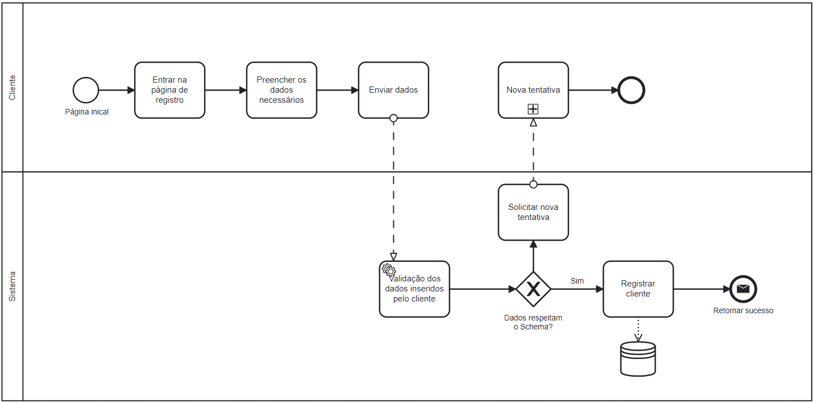

### 3.3.5 Processo 4 – Registrar Cliente

Processo de cadastro de um cliente no website da barbearia.

#### Detalhamento das atividades

**Iniciar processo de registro**

O cliente, a partir da página inicial, deve iniciar o processo por apertar o botão "Registrar"

| **Comandos**         |  **Destino**                   | **Tipo** |
| ---                  | ---                            | ---               |
| cadastrar            | Início do proceso de registro  |                   |

**Inserir os dados necessários**

O cliente preenchera os dados correspondentes nos determinados campos

| **Campo**       | **Tipo**         | **Restrições** | **Valor default** |
| ---             | ---              | ---            | ---               |
| login           | Caixa de Texto   | formato de e-mail |                |
| Nome           | Caixa de texto   |  |           |
| senha           | Caixa de Texto   | mínimo de 8 caracteres |           |
| Data de nascimento           | Data   | Ao menos 12 anos antes do dia de registro |           |

| **Comandos**         |  **Destino**                   | **Tipo** |
| ---                  | ---                            | ---               |
| enviar               | Validação de informações              | default           |

**Valida informações**

A validação das informações acontece no front-end, onde ele verificará se os campos preenchidos pelo cliente respeitam o Schema

| **Comandos**         |  **Destino**                   | **Tipo** |
| ---                  | ---                            | ---               |
| verifica existencia do email               | Exigir confirmação de email              | default           |

