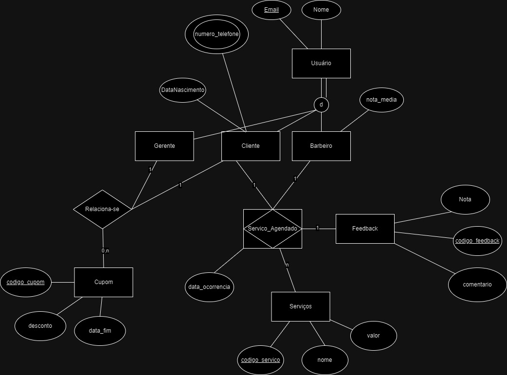

## 4. Projeto da solução

### 4.1. Modelo de dados

Modelo de dados BITBARBER:

---

### 4.2. Tecnologias

As tecnologias que serão utilizadas para o desenvolvimento da aplicação serão:
- Javascript: Javascript é uma linguagem indispensável no desenvolvimento de aplicações Web e será utilizado para compor a parte lógica do frontend das páginas.
- ReactJs: Uma das bibliotecas mais robustas para o desenvolvimento de páginas, permitindo a criação de componentes e reutilizaveis, facilitando o desenvolvimento.
- PostgresSQL: O SGBD escolhido é o postgres, levando em consideração principalmente sua facilitadade de uso para a equipe de Devs
- Springboot: Framework java para o desenvolvimento de APIs web.

| **Dimensão**   | **Tecnologia**  |
| ---            | ---             |
| SGBD           | PostgresSQL           |
| Front end      | JS + HTML + CSS     |
| Back end       | Java SpringBoot |
| Deploy         | Github Pages    |

